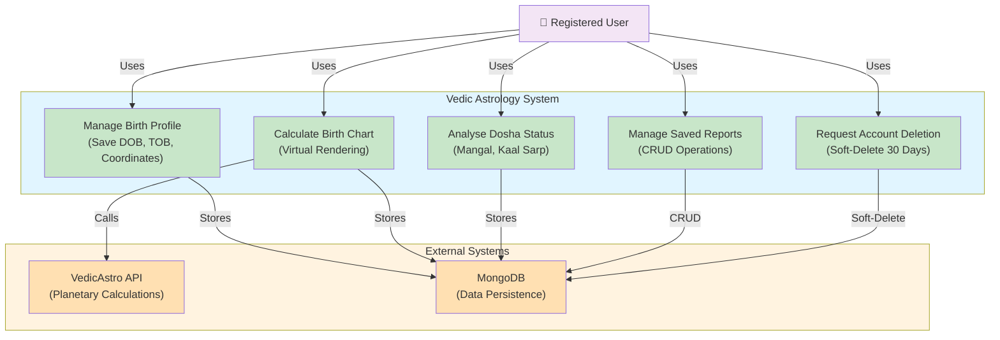

## Use Case Documentation

### 1. **Manage Birth Profile**
- **Description**: Save DOB (Date of Birth), TOB (Time of Birth), and User Coordinates
- **Actors**: Registered User
- **Purpose**: Capture essential biographical data required for astrological calculations
- **Preconditions**: User must be authenticated
- **Main Flow**: User enters birth data → System validates → Data stored in MongoDB

### 2. **Calculate Birth Chart**
- **Description**: Virtual Rendering via VedicAstro API
- **Actors**: Registered User
- **Purpose**: Generate comprehensive birth chart based on user's birth data
- **External Systems**: VedicAstro API
- **Main Flow**: User triggers calculation → System queries VedicAstro API → Results cached and stored

### 3. **Analyse Dosha Status**
- **Description**: Analyze Mangal Dosha, Kaal Sarp Dosha with caching
- **Actors**: Registered User
- **Purpose**: Provide detailed analysis of doshas affecting the user's profile
- **Dosha Analysis**: Mangal Dosha, Kaal Sarp Dosha
- **Performance**: Results cached for optimized retrieval

### 4. **Manage Saved Reports**
- **Description**: CRUD operations for Historical Charts
- **Actors**: Registered User
- **Purpose**: Store, retrieve, update, and manage historical astrological calculations
- **Database**: MongoDB
- **Operations**: Create, Read, Update, Delete historical charts

### 5. **Request Account Deletion**
- **Description**: Soft-Delete with 30-Day Recovery Window
- **Actors**: Registered User
- **Purpose**: Allow users to safely request account deletion with recovery option
- **Implementation**: Soft-delete mechanism protects against accidental data loss
- **Recovery Window**: 30 days for account restoration before permanent deletion

## System Architecture

| Component | Purpose | Details |
|-----------|---------|---------|
| **Registered User** | Primary Actor | Interacts with all use cases |
| **Birth Profile Management** | Data Intake | Stores biographical information |
| **Chart Calculation Engine** | Processing | Integrates with VedicAstro API |
| **Dosha Analysis Engine** | Analysis | Mangal & Kaal Sarp analysis with caching |
| **Report Management** | CRUD Operations | Historical data maintenance in MongoDB |
| **Account Management** | User Control | Soft-delete with 30-day window |
| **VedicAstro API** | External Service | Astronomical calculations |
| **MongoDB** | Database | Centralized data storage |
