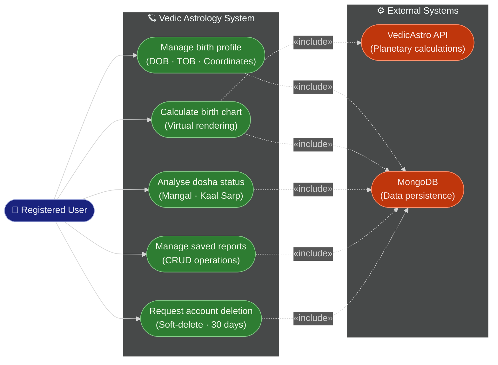

```mermaid
%%{init: {'theme': 'dark', 'themeVariables': { 'darkMode': true }}}%%

graph LR

  Actor(["👤 Registered User"])

  subgraph System ["🪐 Vedic Astrology System"]
    UC1(["Manage birth profile\n(DOB · TOB · Coordinates)"])
    UC2(["Calculate birth chart\n(Virtual rendering)"])
    UC3(["Analyse dosha status\n(Mangal · Kaal Sarp)"])
    UC4(["Manage saved reports\n(CRUD operations)"])
    UC5(["Request account deletion\n(Soft-delete · 30 days)"])
  end

  subgraph External ["⚙️ External Systems"]
    API(["VedicAstro API\n(Planetary calculations)"])
    DB(["MongoDB\n(Data persistence)"])
  end

  Actor --> UC1
  Actor --> UC2
  Actor --> UC3
  Actor --> UC4
  Actor --> UC5

  UC1 -.->|«include»| DB
  UC2 -.->|«include»| API
  UC2 -.->|«include»| DB
  UC3 -.->|«include»| DB
  UC4 -.->|«include»| DB
  UC5 -.->|«include»| DB

  style Actor   fill:#1a237e,stroke:#9fa8da,color:#e8eaf6
  style UC1     fill:#2e7d32,stroke:#81c784,color:#f1f8e9
  style UC2     fill:#2e7d32,stroke:#81c784,color:#f1f8e9
  style UC3     fill:#2e7d32,stroke:#81c784,color:#f1f8e9
  style UC4     fill:#2e7d32,stroke:#81c784,color:#f1f8e9
  style UC5     fill:#2e7d32,stroke:#81c784,color:#f1f8e9
  style API     fill:#bf360c,stroke:#ff8a65,color:#fbe9e7
  style DB      fill:#bf360c,stroke:#ff8a65,color:#fbe9e7
```
