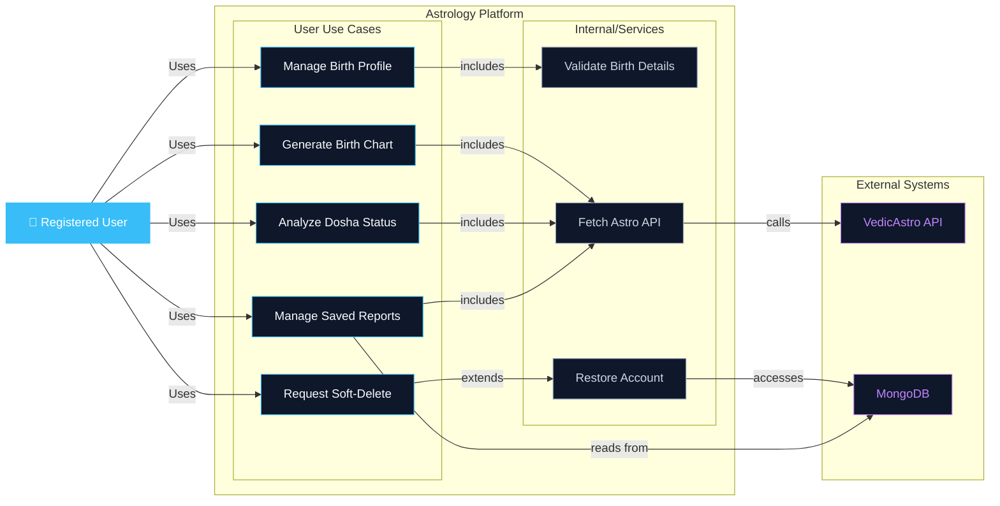

# Astrology Platform Architecture

## Overview
This document outlines the use case diagram for the Simplified Astrology Platform built with Node.js. The platform provides comprehensive astrology services including birth profile management, birth chart generation, dosha analysis, and report management.

## Use Case Diagram

## Use Cases Description

### User Interactions
- **Manage Birth Profile**: Allows registered users to create and update their birth information (date, time, location)
- **Generate Birth Chart**: Creates personalized birth charts based on user's birth details
- **Analyze Dosha Status**: Analyzes and provides insights on the user's dosha composition (Vata, Pitta, Kapha)
- **Manage Saved Reports**: Enables users to view, organize, and manage their previously generated reports
- **Request Soft-Delete**: Allows users to request account deletion with a 30-day recovery window

### Internal Services
- **Validate Birth Details**: Validates the accuracy and completeness of birth information
- **Fetch Astro API**: Connects with VedicAstro API to retrieve astrology calculations and data
- **Restore Account**: Handles account recovery within the 30-day window after soft deletion

### External Systems
- **VedicAstro API**: Third-party astrology calculation and data service
- **MongoDB**: Database for storing user profiles, charts, and reports

## Key Relationships
- **Includes**: Internal use cases required by user-facing use cases
- **Extends**: Optional or extended functionality (account restoration after deletion)
- **System Integration**: Direct connections to external APIs and database systems

---
Generated for Project Amica | Date: April 2026
